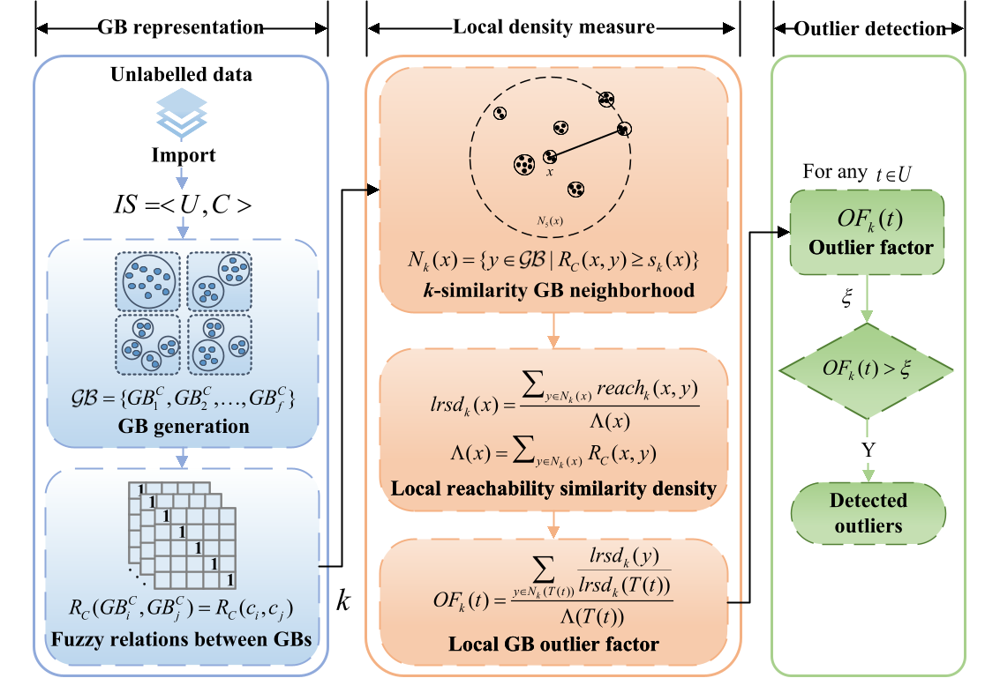

# GBDO

Xinyu Su, Xiwen Wang, Dezhong Peng, Xiaomin Song, Huiming Zheng, and **Zhong Yuan***, [Identifying Outliers via Local Granular-Ball Density](https://ieeexplore.ieee.org/abstract/document/11073180), IEEE Transactions on Neural Networks and Learning Systems, 2025.

## Abstract
Existing density-based outlier detection methods process data at the single-granularity level of individual samples, requiring pairwise distance calculations between all samples and exhibiting high sensitivity to noise. The single-granularity-based processing paradigm fails to mine the information at multiple levels of granularity in data, and most of these methods ignore the potential uncertainty information in data, such as fuzziness, resulting in an inability to effectively detect potential outliers in data. As a novel granular computing method, Granular-Ball Computing (GBC) is characterized by its multi-granularity and robustness, which makes it able to make up for the above drawbacks well. In this study, we propose local GranularBall Density-based Outlier (GBDO) detection to improve the performance of the density-based methods. In GBDO, we first identify the $k$-similarity Granular-Ball (GB) neighborhoods of each GB via the fuzzy relations among them. Subsequently, the local reachability similarity density of the GBs is calculated through the reachability similarity we defined. Finally, the local GB outlier factors of the samples are calculated based on the local reachability similarity density of the GBs. We adopt a multi-granularity processing paradigm using GBs as the basic units, which reduces computational complexity and improves robustness to noisy data by leveraging the multigranularity nature of GBs. The experimental results demonstrate the effectiveness of GBDO by comparing it with state-of-the-art methods. The source code and datasets are publicly available at https://github.com/Mxeron/GBDO.

> More details on granular-ball generation can be found in **Xia, S., Shi, B., Wang, Y., Xie, J., Wang, G., & Gao, X. (2025). GBCT: efficient and adaptive clustering via granular-ball computing for complex data. IEEE Transactions on Neural Networks and Learning Systems.**

## Framework



## Usage
You can run GBDO.py:
```python
if __name__ == '__main__':
    data = pd.read_csv("./Example.csv")
    scaler = MinMaxScaler()
    data = scaler.fit_transform(data)
    gb_list, point_to_gb, fuzzy_similarity = GB_Generate(data)
    print(f"粒球数量: {len(gb_list)}")
    OF = GBDO(gb_list, point_to_gb, fuzzy_similarity, 3)
    print(OF)
```
You can get outputs as follows:
```
粒球数量: 6
[1.16267042 1.15468636 1.15553024 1.15468636 1.15468636 1.16743584
 1.16267042 1.16743584 1.15553024 1.16267042 1.16267042 1.1478509
 1.15468636 1.15553024 1.16743584 1.16267042 1.16385854 1.16267042
 1.16385854 1.16267042]
```
## Citation
If you find GBDO useful in your research, please consider citing:
```
@article{su2025identifying,
  title={Identifying Outliers via Local Granular-Ball Density},
  author={Su, Xinyu and Wang, Xiwen and Peng, Dezhong and Song, Xiaomin and Zheng, Huiming and Yuan, Zhong},
  journal={IEEE Transactions on Neural Networks and Learning Systems},
  year={2025},
  volume={},
  number={},
  pages={1-12},
  publisher={IEEE}
}
```
## Contact
If you have any questions, please contact suxinyu@stu.scu.edu.cn or yuanzhong@scu.edu.cn.


